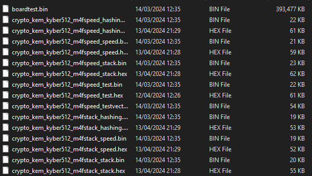
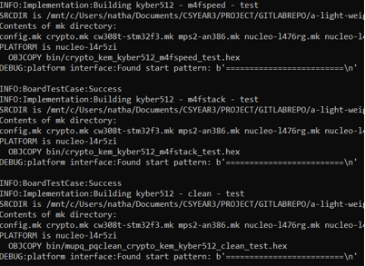
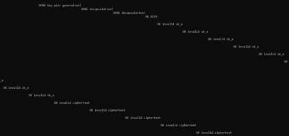
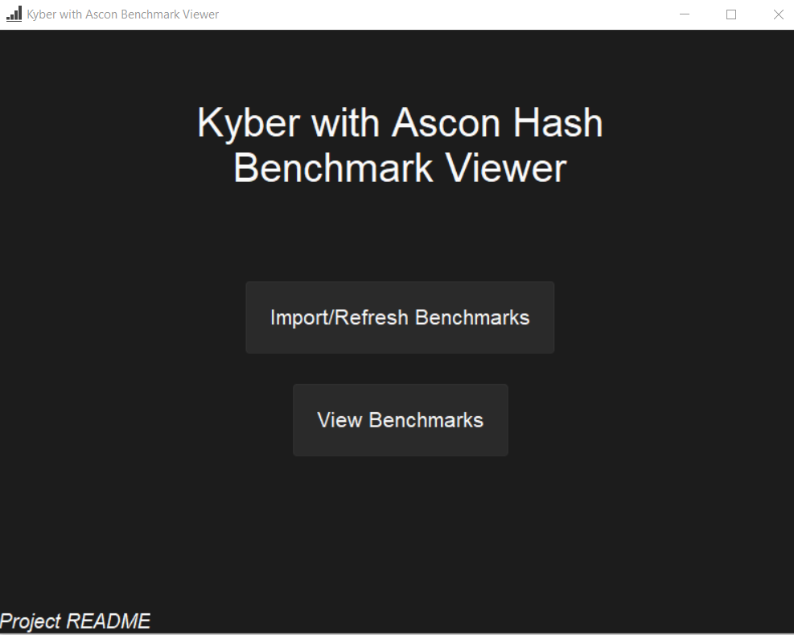

# A Light-weight Quantum-resistant Public Key Encryption scheme on an ARM processor

## Project Description
Implementing the lightweight ASCON hash into KYBER to enable it to be more suitable for low-resource, low-power devices.

---

## Contents
- [Project Description](#Project Description)
- [Contents](#contents)
- [Project Aims](#Project Aims)
- [Project Structure](#Project Structure)
- [Compiling, Testing and Benchmarking the Project](#Compiling, Testing and Benchmarking the Project)

---

## Project Aims
1. Exploration and understanding of the Post Quantum Cryptography (Kyber in particular) and the
Lightweight cryptography (ASCON in particular).
2. Learn to use the ARM Cortex-M4 processor chip on a Nucleo board. Analysis and understanding of the
open-source C code for the Kyber KEM on the board.
3. Integration of the LWC scheme (e.g., ASCON) with the CRYSTALS Kyber and correctness checking.
4. Detailed benchmarking of the merger of these to evaluate its suitability for IoT applications. This may
include the effect on code size, memory usage, decoding errors rate etc.
5. Develop comprehensive documentation for the implementation, including detailed usage guidelines and
code examples. Implement rigorous testing procedures to validate the correctness and security of the
cryptographic implementations.

---

## Project Structure
The root directory currently consists of 9 folders:
- **initial_board_testing**: A compilation of test projects used in the initial understanding of the NUCLEO board.
- **benchmarks**: The benchmark viewer interface, all combined benchmark files.
- **project documentation**: All project documentation; reports, meeting minutes, dissertation etc.
- **kyber512reference**: The reference version of PQM4 implementation of Kyber 512.
- **kyber512speed**: The Ascon-Speed implementation of Kyber 512.
- **kyber512small**: The Ascon-Small implementation of Kyber 512.
- **kyber512lowsize**: The Ascon-Lowsize implementation of Kyber 512.
- **kyber512bi32speed**: The Ascon-32bit-interleaved-speed implementation of Kyber 512.
- **kyber512bi32small**: The Ascon-32bit-interleaved-small implementation of Kyber 512.

---

## Compiling, Testing and Benchmarking the Project

### Pre-requisites:

Follow the instructions linked below to install all pre-requisites for compiling this project:

[PQM4 Setup guide for NUCLEO L4R5ZI](https://github.com/QUB-ARM-STM32/pqm4)

Each folder prefixed with 'kyber512' is its own submodule within this project. 
Compilation, testing and benchmarking can only be done within each individual folder, as such to benchmark every scheme, the below steps will need to be repeated for each submodule.


### Compiling:

Within each kyber512 folder there is a `bin/` folder and an `elf/` folder.
These folders contain the compiled files that can be executed on the Nucleo board. 
To recompile the project you first need to run, with a Linux shell open on the root submodule directory:

```bash
make clean
```
This will clear all the binaries and files invlolved in building and compilation, meaning the project can now be built from scratch.

To compile the scheme's code into flashable binaries, with a Linux shell open on the root submodule directory run the following command:

```bash
make -j8 PLATFORM=nucleo-l4r5zi
```

Where `-j` is the number of jobs to run at once.

This command may take some time to complete especially of you are operating over the windows file-system.

Once the command finishes executing you should see the results in the `bin/` and `elf/` folders.



### Testing:

To run the suite of PQM4 functional tests on a scheme, you will need to ensure that the Nucleo board is correctly setup using WSL.
Instructions on how to do this can be found within the above setup guide in the `flashing` section.

With the board set up correctly through a Linux shell open on the root submodule directory, run:

```bash
sudo python3 test.py -p nucleo-l4r5zi -u /dev/ttyACM0 kyber512
```

Where `-p` is the platform, `-u` is the serial port and `kyber512` is the algorithm to test.



To directly view the output of the tests from the board, you can use the `screen` command to open a serial monitor to view the output. To do this run:

```bash
sudo screen /dev/ttyACM0 38400
```

This will open a serial monitor on device `ttyACM0` and with a baud rate of `38400`. You will likely need to press the reset button on your board. If you see the following output then you have successfully flashed the binary.


	
The output will be hard to decipher as it is designed to be used with the testing and benchmarking tools available in the pqm4 library.

To exit simply press `Ctrl + A` followed by `k`.

### Benchmarking:

To run the benchmarks you can use the PQM4 benchmarking framework. With the board passed through to WSL you can run:

```bash
sudo python3 benchmarks.py -p nucleo-l4r5zi -u /dev/ttyACM0 kyber512
```

- `-p` specifies the platform from the list of supported platforms found [here](https://github.com/mupq/pqm4#setupinstallation)
- `-u` specifies the serial port to use

The results will be stored to the `benchmarks/` directory in each submodule, **not** the benchmarks folder at the root of the project repo. To view the results in a more readable format you can use the provided script:

To produce a CSV file run:
```bash
python3 convert_benchmarks.py csv > results.csv
```

To produce a markdown document run:
```bash
python3 convert_benchmarks.py md > results.md
```

**To be able to use the benchmark interface in its full capacity, it is important to produce both MD and CSV files for each scheme benchmarked**

### Using the benchmark viewer interface

To use the benchmark viewer interface coupled with this project it is very simple.
To run the interface you will need Python 3 installed. With Python installed, navigate to the `root/benchmarks/` folder of the project.
Then, right click the `viewBenchmarks` file and run using Python. This will open the main screen.



From the main screen you can either choose to import benchmarks or view benchmarks. 
Importing benchmarks allows you to pull the benchmark data from each of the submodules `results.csv` and `results.md` files into the combined results files.
The benchmark interface does not import results from any other files, it is important to make sure these files exist in each submodule.

The view benchmarks screen contains a brief analysis of all schemes imported, and options to display charts comparing the metrics of each scheme.


---